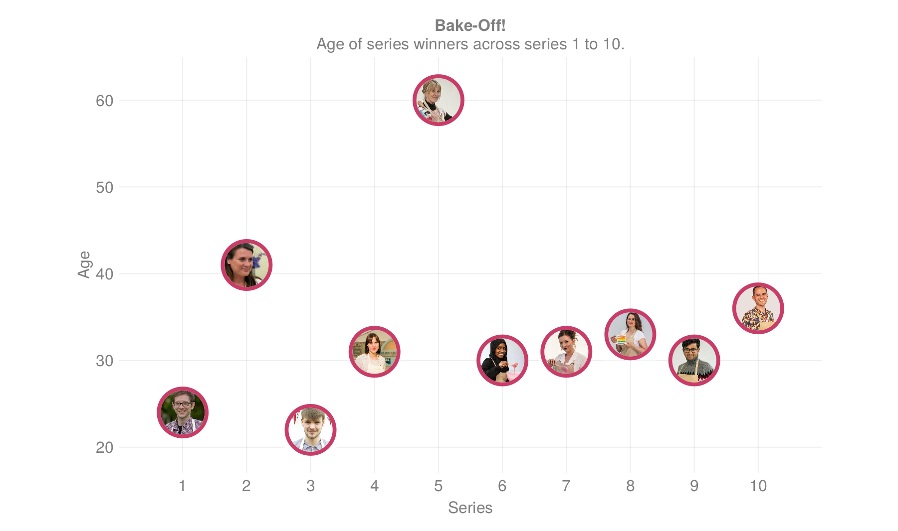
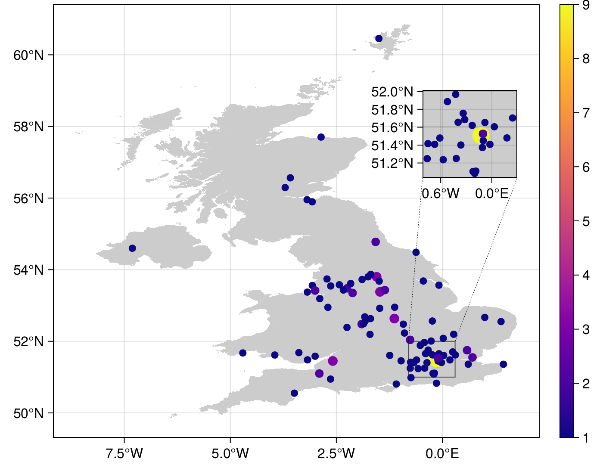

# Bake-Off Data

This week was fun. I learnt about `image` function in `Makie.jl`, as well as more advanced `scatter` objects, creating my own structure. I also learnt how to scrape the web with `Cascadia.jl`, `Gumbo.jl`, and `HTTP.jl` in order to get hometown coordinates from wikipedia for each baker. I also used these to extract an image for each baker from [Bake-off website](https://thegreatbritishbakeoff.co.uk).

## How many times did each series winner achieve Star Baker?

## How old are the series winners?

## Where are contestants from?

