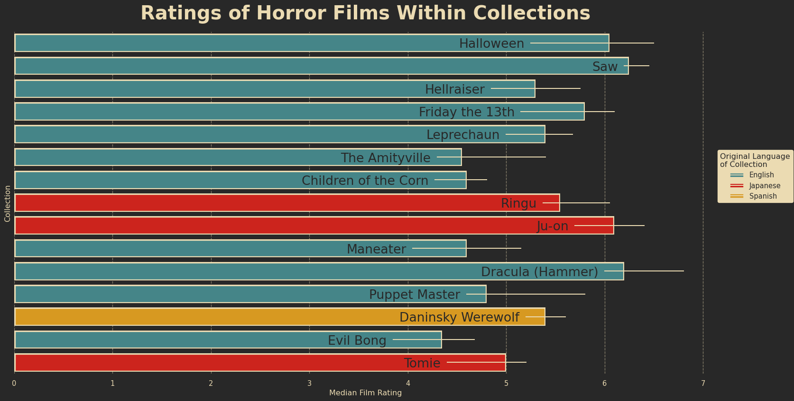

# 2022-11-01: Horror Movies

Wteek 44. This week I am working in Python.

## Image

Ratings of films within collections. Median and quartile range of average film ratings for all films within collection. Coloured by original film language.

## Data

Data from [The Movie Database](https://www.themoviedb.org/)
More information can be found at [Tanya Shapiro's Horror Movies](https://github.com/tashapiro/horror-movies)

### Tables

#### `horror_movies.csv`

##### Data Type

| Column              | Type    |
|:--------------------|:--------|
| `id`                | int64   |
| `original_title`    | object  |
| `title`             | object  |
| `original_language` | object  |
| `overview`          | object  |
| `tagline`           | object  |
| `release_date`      | object  |
| `poster_path`       | object  |
| `popularity`        | float64 |
| `vote_count`        | int64   |
| `vote_average`      | float64 |
| `budget`            | int64   |
| `revenue`           | int64   |
| `runtime`           | int64   |
| `status`            | object  |
| `adult`             | bool    |
| `backdrop_path`     | object  |
| `genre_names`       | object  |
| `collection`        | float64 |
| `collection_name`   | object  |

##### Data Summary

| Column         |   count |             mean |              std |   min |      25% |       50% |          75% |             max |
|:---------------|--------:|-----------------:|-----------------:|------:|---------:|----------:|-------------:|----------------:|
| `id`           |   32540 | 445911           | 305745           |    17 | 146495   | 426521    | 707534       |     1.0331e+06  |
| `popularity`   |   32540 |      4.01346     |     37.5135      |     0 |      0.6 |      0.84 |      2.24325 |  5088.58        |
| `vote_count`   |   32540 |     62.6915      |    420.887       |     0 |      0   |      2    |     11       | 16900           |
| `vote_average` |   32540 |      3.33573     |      2.876       |     0 |      0   |      4    |      5.7     |    10           |
| `budget`       |   32540 | 543127           |      4.54267e+06 |     0 |      0   |      0    |      0       |     2e+08       |
| `revenue`      |   32540 |      1.34975e+06 |      1.44305e+07 |     0 |      0   |      0    |      0       |     7.01843e+08 |
| `runtime`      |   32540 |     62.1429      |     40.9985      |     0 |     14   |     80    |     91       |   683           |
| `collection`   |    2306 | 481535           | 324498           |   656 | 155421   | 471259    | 759067       |     1.03303e+06 |

## Ideas

The linked article showed the relationship between number of releases and month of release. This demonstrated that Halloween is the most common month of release for horror movies. Do we have a similar trend if we consider the rating? Are horror films released at/for Halloween considered better than those released at other times in the year?

Similarly, are horror films likely to make more money if they are released for Halloween?

## Reviews and Release Month

#### Releases by release month

Here I have filtered out films whose budget was 0, then counted the number of releases by month of release. I find the same pattern as the article above, although I have not selected only films released between 2016 and  2021.

| month | count |
|------:|------:|
|     1 |   546 |
|     2 |   299 |
|     3 |   386 |
|     4 |   378 |
|     5 |   423 |
|     6 |   372 |
|     7 |   329 |
|     8 |   412 |
|     9 |   462 |
|    10 |   890 |
|    11 |   383 |
|    12 |   321 |

#### Reviews

I want to get an average review score for movies released in a given month (for any year). I cannot simply take the average of the review average as this would be unbalanced/biased. The approach is to compute the total number of stars for each film, sum them then compute the average for the month.

I also need to consider how many reviews a film has received. I don't want to bias my results by including films which have received very few reviews - for example a film with two 10 star reviews could be invalid (votes could be by producers for example...).

I will filter films by number of reviews. However, it is worth noting that the median number of reviews is 2... So I am going to be excluding a lot of reviews.

| Number of Votes | Number of Films |
|:----------------|----------------:|
|               0 |           11602 |
|             1-9 |           12461 |
|           10-24 |            3187 |
|           25-49 |            1803 |
|           50-99 |            1240 |
|         100-199 |             791 |
|            200+ |            1456 |

Let's select films which have at least 10 reviews. This is still somewhat low, but I want to include as many films as possible without including poor data.

| `month` | `vote_count` | `av_review_score` |
|--------:|-------------:|------------------:|
|       1 |       153195 |           6.03193 |  
|       2 |       136016 |           6.27828 |  
|       3 |       137457 |           6.31334 |  
|       4 |       129900 |           6.23384 |  
|       5 |       165749 |           6.46358 |  
|       6 |       177702 |           6.60217 |  
|       7 |       148587 |           6.28561 |  
|       8 |       193363 |           6.13079 |  
|       9 |       222010 |           6.25443 |  
|      10 |       324507 |           6.27056 |  
|      11 |       128647 |           6.46708 |  
|      12 |        83403 |           6.44338 |  

It is clear that there is no noticeable difference here. The average review score is between 6 and 6.5 for all months. Films released in October have no discernible difference to the norm. 

## Revenue / Profit and Release Month

Average revenue and budget by month. Percentage profit computed from average revenue and budget.

| month |     `av_revenue` | `av_budget` | `profit_percent` |
|------:|-----------------:|------------:|-----------------:|
|     1 | 631209           |      304229 |         107.478  |
|     2 |      1.58215e+06 |      801741 |          97.3397 |
|     3 |      1.13413e+06 |      559793 |         102.597  |
|     4 |      1.09006e+06 |      479419 |         127.372  |
|     5 |      1.36468e+06 |      552116 |         147.172  |
|     6 |      2.08387e+06 |      787776 |         164.526  |
|     7 |      1.87576e+06 |      597624 |         213.869  |
|     8 |      1.97326e+06 |      842532 |         134.206  |
|     9 |      1.75407e+06 |      600640 |         192.034  |
|    10 |      1.40726e+06 |      485559 |         189.822  |
|    11 |      1.17962e+06 |      532758 |         121.417  |
|    12 |      1.05262e+06 |      418388 |         151.591  |

Once again we find that there is no Halloween effect on revenue, budget, or profit - at least not one that can be determined by my approach. I do observe that Christmas and summer have a noticeable impact on all metrics in the above table. Let's consider a different approach.

## Language

Let's investigate the impact of original language of a film.
