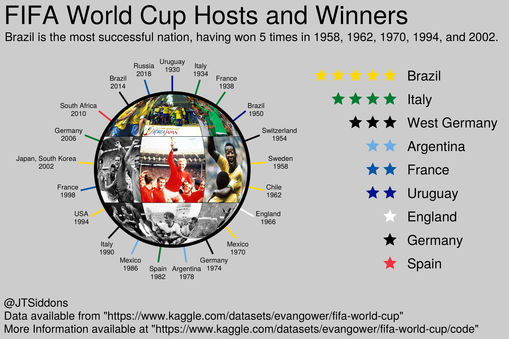

# 2022-11-29: FIFA World Cup

Week 48. This week I am working in Julia.

## World Cup Hosts and Winners 

## Data

Data from [Kaggle FIFA World Cup](https://www.kaggle.com/datasets/evangower/fifa-world-cup/)
More information can be found at [Dataset Notebooks](https://www.kaggle.com/datasets/evangower/fifa-world-cup/code)

### Tables

#### `wcmatches.csv`

##### Data Type

|                | type   |
|:---------------|:-------|
| year           | int64  |
| country        | object |
| city           | object |
| stage          | object |
| home_team      | object |
| away_team      | object |
| home_score     | int64  |
| away_score     | int64  |
| outcome        | object |
| win_conditions | object |
| winning_team   | object |
| losing_team    | object |
| date           | object |
| month          | object |
| dayofweek      | object |

##### Data Summary

|            |   count |       mean |      std |   min |   25% |   50% |   75% |   max |
|:-----------|--------:|-----------:|---------:|------:|------:|------:|------:|------:|
| year       |     900 | 1986.92    | 23.1503  |  1930 |  1970 |  1990 |  2006 |  2018 |
| home_score |     900 |    1.56889 |  1.48957 |     0 |     0 |     1 |     2 |    10 |
| away_score |     900 |    1.26222 |  1.31396 |     0 |     0 |     1 |     2 |     8 |

|                |   count |   unique | top              |   freq |
|:---------------|--------:|---------:|:-----------------|-------:|
| country        |     900 |       17 | Germany          |    102 |
| city           |     900 |      161 | Mexico City      |     23 |
| stage          |     900 |       22 | Round of 16      |     89 |
| home_team      |     900 |       81 | Brazil           |     84 |
| away_team      |     900 |       82 | Uruguay          |     37 |
| outcome        |     900 |        3 | H                |    429 |
| win_conditions |      62 |       48 | Italy won in AET |      5 |
| winning_team   |     731 |       66 | Brazil           |     76 |
| losing_team    |     731 |       85 | Mexico           |     29 |
| date           |     900 |      355 | 1934-05-27       |      8 |
| month          |     900 |        3 | Jun              |    727 |
| dayofweek      |     900 |        7 | Sunday           |    196 |

#### `worldcups.csv`

##### Data Type

|              | type   |
|:-------------|:-------|
| year         | int64  |
| host         | object |
| winner       | object |
| second       | object |
| third        | object |
| fourth       | object |
| goals_scored | int64  |
| teams        | int64  |
| games        | int64  |
| attendance   | int64  |

##### Data Summary

|              |   count |           mean |          std |    min |    25% |            50% |           75% |            max |
|:-------------|--------:|---------------:|-------------:|-------:|-------:|---------------:|--------------:|---------------:|
| year         |      21 | 1976.86        | 26.6576      |   1930 |   1958 | 1978           | 1998          | 2018           |
| goals_scored |      21 |  121.333       | 33.9431      |     70 |     89 |  126           |  146          |  171           |
| teams        |      21 |   21.7619      |  7.46261     |     13 |     16 |   16           |   32          |   32           |
| games        |      21 |   42.8571      | 17.4679      |     17 |     32 |   38           |   64          |   64           |
| attendance   |      21 |    1.89812e+06 |  1.02795e+06 | 395000 | 943000 |    1.77402e+06 |    2.7246e+06 |    3.56857e+06 |

|        |   count |   unique | top       |   freq |
|:-------|--------:|---------:|:----------|-------:|
| host   |      21 |       16 | Italy     |      2 |
| winner |      21 |        9 | Brazil    |      5 |
| second |      21 |       11 | Argentina |      3 |
| third  |      21 |       15 | Germany   |      3 |
| fourth |      21 |       16 | Uruguay   |      3 |
