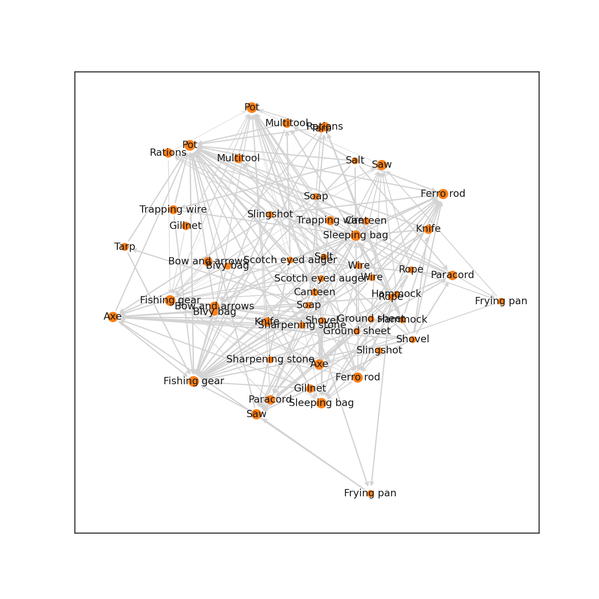

# 2023-01-24: Alone data

Week 4. This week I am working in Python. I am going to experiment with the `polars` module, which
is a DataFrame library written in rust. It has a python module which I will work with this week, and
I'll experiment with the rust crate next week.

Documentation for `polars` can be found [here](https://www.pola.rs/).

## Plots

The plot this week is currently somewhat rough. I will look at improving it at some point during
the week. Below is a graph highlighting use of items in contestant loadout. The arrows indicate that
the tail is used with its head. Width indicates relative frequency to item's individual use. For
example, the thickness of the arrow from `pot` to `sleeping bag` is calculated as the number of 
times both `pot` and `sleeping bag` are used, divided by the number of times `pot` is used.

Node size is the number of times the item is a part of a contestant's loadout.

## Data (The below is automatically generated)

Data from [Alone data package](https://github.com/doehm/alone)
More information can be found at [Alone R package: Datasets from the survival TV series](https://gradientdescending.com/alone-r-package-datasets-from-the-survival-tv-series/)

### Tables

#### `survivalists.csv`

##### Data Type

|                     | type    |
|:--------------------|:--------|
| season              | int64   |
| name                | object  |
| age                 | int64   |
| gender              | object  |
| city                | object  |
| state               | object  |
| country             | object  |
| result              | int64   |
| days_lasted         | int64   |
| medically_evacuated | bool    |
| reason_tapped_out   | object  |
| reason_category     | object  |
| team                | object  |
| day_linked_up       | float64 |
| profession          | object  |
| url                 | object  |

##### Data Summary

|               |   count |     mean |       std |   min |   25% |   50% |   75% |   max |
|:--------------|--------:|---------:|----------:|------:|------:|------:|------:|------:|
| season        |      94 |  4.95745 |  2.5481   |     1 |  3    |   5   |  7    |     9 |
| age           |      94 | 37.9362  |  8.84491  |    19 | 31    |  38.5 | 44    |    61 |
| result        |      94 |  5.2766  |  2.82616  |     1 |  3    |   5   |  7.75 |    10 |
| days_lasted   |      94 | 39.0426  | 27.8494   |     0 | 10.5  |  39.5 | 63.75 |   100 |
| day_linked_up |       8 |  9       |  0.755929 |     8 |  8.75 |   9   |  9.25 |    10 |

|                   |   count |   unique | top                      |   freq |
|:------------------|--------:|---------:|:-------------------------|-------:|
| name              |      94 |       84 | Brad Richardson          |      2 |
| gender            |      94 |        2 | Male                     |     74 |
| city              |      94 |       77 | Fox Lake                 |      3 |
| state             |      93 |       40 | Alaska                   |     11 |
| country           |      94 |        4 | United States            |     79 |
| reason_tapped_out |      84 |       61 | Starvation               |      7 |
| reason_category   |      84 |        3 | Medical / health         |     45 |
| team              |      14 |        7 | Baird (brothers)         |      2 |
| profession        |      94 |       80 | Carpenter                |      4 |
| url               |      94 |       87 | brad-and-josh-richardson |      2 |

#### `loadouts.csv`

##### Data Type

|               | type   |
|:--------------|:-------|
| version       | object |
| season        | int64  |
| name          | object |
| item_number   | int64  |
| item_detailed | object |
| item          | object |

##### Data Summary

|             |   count |    mean |     std |   min |   25% |   50% |   75% |   max |
|:------------|--------:|--------:|--------:|------:|------:|------:|------:|------:|
| season      |     940 | 4.95745 | 2.53586 |     1 |     3 |   5   |     7 |     9 |
| item_number |     940 | 5.5     | 2.87381 |     1 |     3 |   5.5 |     8 |    10 |

|               |   count |   unique | top             |   freq |
|:--------------|--------:|---------:|:----------------|-------:|
| version       |     940 |        1 | US              |    940 |
| name          |     940 |       84 | Brad Richardson |     20 |
| item_detailed |     940 |      198 | Ferro rod       |     66 |
| item          |     940 |       27 | Pot             |     92 |

#### `episodes.csv`

##### Data Type

|                        | type    |
|:-----------------------|:--------|
| version                | object  |
| season                 | int64   |
| episode_number_overall | int64   |
| episode                | int64   |
| title                  | object  |
| air_date               | object  |
| viewers                | float64 |
| quote                  | object  |
| author                 | object  |
| imdb_rating            | float64 |
| n_ratings              | float64 |

##### Data Summary

|                        |   count |     mean |       std |   min |    25% |    50% |     75% |     max |
|:-----------------------|--------:|---------:|----------:|------:|-------:|-------:|--------:|--------:|
| season                 |      98 |  4.96939 |  2.63386  | 1     |  3     |  5     |  7      |   9     |
| episode_number_overall |      98 | 50.1633  | 29.0399   | 1     | 25.25  | 50.5   | 74.75   | 100     |
| episode                |      98 |  5.97959 |  3.21074  | 1     |  3     |  6     |  9      |  13     |
| viewers                |      83 |  1.52788 |  0.270149 | 0.989 |  1.344 |  1.507 |  1.6875 |   2.375 |
| imdb_rating            |      93 |  7.82151 |  0.365302 | 6.9   |  7.6   |  7.8   |  8.1    |   8.8   |
| n_ratings              |      93 | 62.9247  | 20.0815   | 5     | 48     | 63     | 68      | 135     |

|          |   count |   unique | top                                                                        |   freq |
|:---------|--------:|---------:|:---------------------------------------------------------------------------|-------:|
| version  |      98 |        1 | US                                                                         |     98 |
| title    |      98 |       98 | And So It Begins                                                           |      1 |
| air_date |      98 |       97 | 2016-07-14                                                                 |      2 |
| quote    |      98 |       96 | The very basic core of a man's living spirit is his passion for adventure. |      2 |
| author   |      98 |       84 | John Muir                                                                  |      4 |

#### `seasons.csv`

##### Data Type

|               | type    |
|:--------------|:--------|
| version       | object  |
| season        | int64   |
| location      | object  |
| country       | object  |
| n_survivors   | int64   |
| lat           | float64 |
| lon           | float64 |
| date_drop_off | object  |

##### Data Summary

|             |   count |     mean |      std |      min |       25% |       50% |    75% |      max |
|:------------|--------:|---------:|---------:|---------:|----------:|----------:|-------:|---------:|
| season      |       9 |   5      |  2.73861 |    1     |    3      |    5      |   7    |   9      |
| n_survivors |       9 |  10.4444 |  1.33333 |   10     |   10      |   10      |  10    |  14      |
| lat         |       9 |  43.8723 | 32.2183  |  -41     |   50.7244 |   50.7244 |  59.66 |  61.5003 |
| lon         |       9 | -84.48   | 75.84    | -127.498 | -127.498  | -114.001  | -68    | 106.5    |

|               |   count |   unique | top        |   freq |
|:--------------|--------:|---------:|:-----------|-------:|
| version       |       9 |        1 | US         |      9 |
| location      |       9 |        7 | Quatsino   |      2 |
| country       |       9 |        3 | Canada     |      7 |
| date_drop_off |       3 |        3 | 2019-09-18 |      1 |

## Thoughts on `polars`

Overall, I like manipulating data with `polors`, the syntax is nice, and the structure of queries
feels natural and intuitive. The big downside is that it doesn't interact well with the plotting
libraries. For example, `bokeh` does not interact with `polars` at all, I have to convert columns
to `numpy` arrays or to `pandas` for it to function, which is pointless. `seaborn` is better, but
not all plotting functions interact with `polars`, and I sometimes need to convert to a `numpy`
array, or to a `pandas` frame.

Hopefully in future there will be better interaction between the plotting libraries and `polars`.
